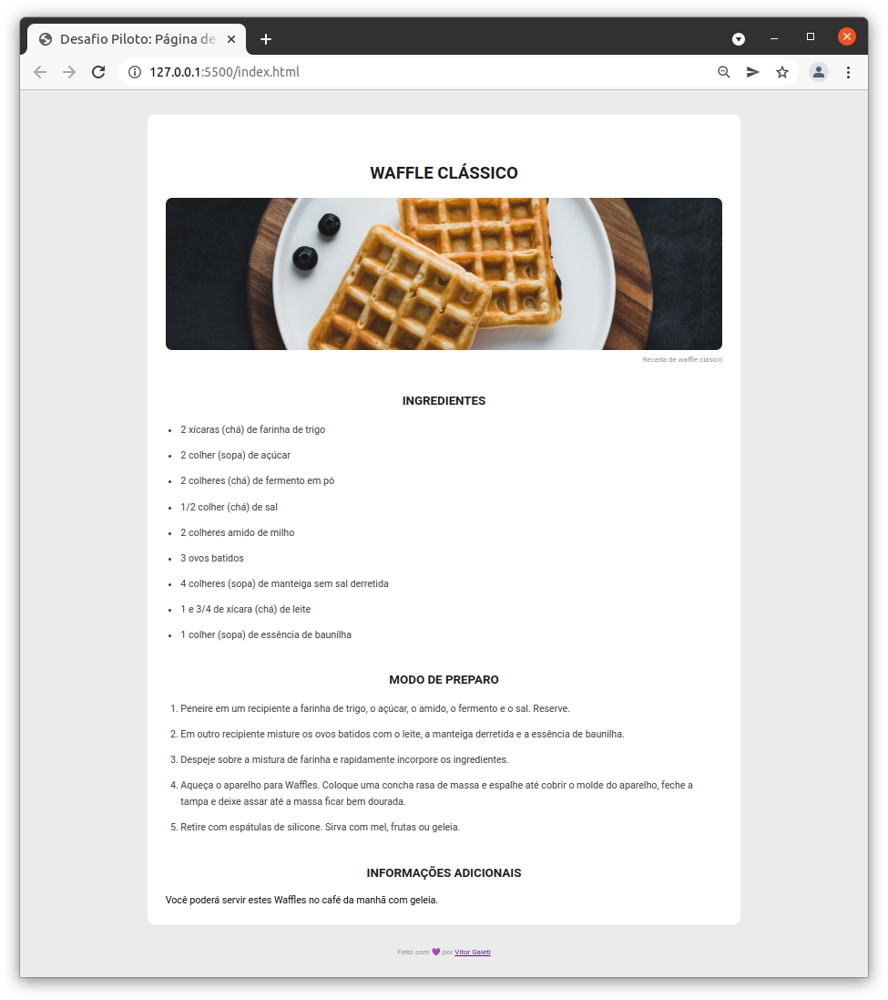

# Desafio Piloto: Página de Receita

## :rocket: Sobre o desafio

Nesse desafio você deverá criar uma página web de uma receita com título, imagem, lista de ingredientes e modo de preparo.
O desafio está dividido em duas partes, no primeiro momento você irá criar a estrutura HTML com as informações da receita e na segunda parte será o momento de adicionar os estilos à página com o CSS.

Feito com ♥ by Vitor Galeti :wave:
